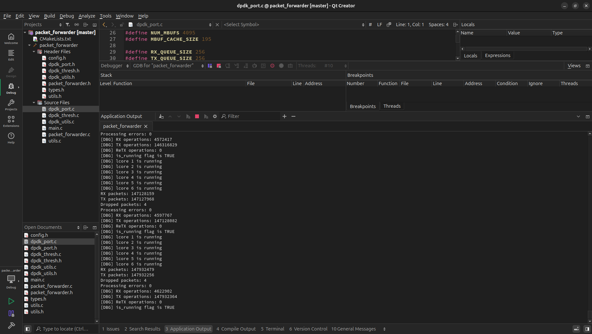
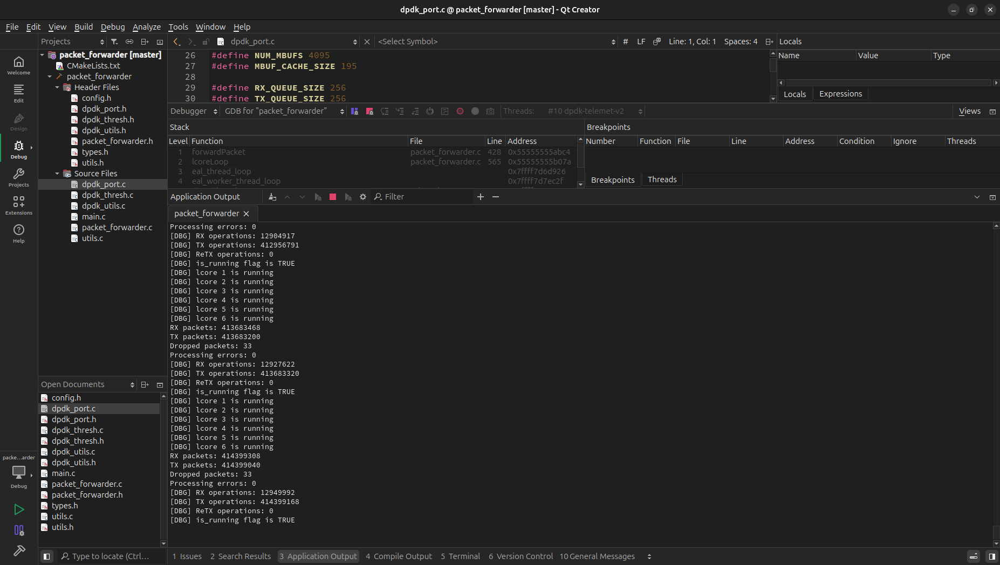

# Packet forwarder

You need:

- DPDK 24.11.1
- CMake 3.16 or later
- A C compiler that supports C99
- A PCAP library (it's the only way for me).

To compile:

    mkdir build
    cd build
    cmake ..
    cmake --build .

To run:

    sudo dpdk-hugepages.py -p 1G --setup 4G 
    sudo ./packet_forwarder -l 0-3 -n 2 -- -p 0
    
Use `Ctrl+C` for stop (2 seconds delay).

For more information see [here](doc/task.txt).

## libpcap-base PMD

`2 ports x 1 queue pairs = 2 forwarders + stats loop (enp1s0 <-> wlp2s0):`

    sudo ./packet_forwarder -l 0-2 -n 2 --no-pci \
        --vdev 'net_pcap0,iface=enp1s0' --vdev 'net_pcap1,iface=wlp2s0'
        
`2 ports x 2 queue pairs = 4 forwarders + stats loop (enp1s0 <-> wlp2s0):`

    sudo ./packet_forwarder -l 0-4 -n 2 --no-pci \
        --vdev 'net_pcap0,rx_iface=enp1s0,rx_iface=enp1s0,tx_iface=enp1s0,tx_iface=enp1s0' \
        --vdev 'net_pcap1,rx_iface=wlp2s0,rx_iface=wlp2s0,tx_iface=wlp2s0,tx_iface=wlp2s0'

`2 ports x 3 queue pairs = 6 forwarders + stats loop (enp1s0 <-> wlp2s0):`

    sudo ./packet_forwarder -l 0-6 -n 2 --no-pci \
        --vdev 'net_pcap0,rx_iface=enp1s0,rx_iface=enp1s0,rx_iface=enp1s0,tx_iface=enp1s0,tx_iface=enp1s0,tx_iface=enp1s0' \
        --vdev 'net_pcap1,rx_iface=wlp2s0,rx_iface=wlp2s0,rx_iface=wlp2s0,tx_iface=wlp2s0,tx_iface=wlp2s0,tx_iface=wlp2s0'

### Как работает

При запуске без дополнительных опций, форвардер читает все пакеты из порта **P** и переселает пакеты IPv4/6 в порт **P ^ 1** или обратно в порт **P**, если порт **P ^ 1** недоступен, а если он доступен, то форвардер будет также пересылать пакеты IPv4/6 из него в порт номер **P**, то есть осуществлять обмен между смежными портами, как мост, фильтруя при этом трафик и изменяя пакеты описанным ниже способом.
К примеру, между пятью портами схема пересылки будет такой:

    0 <-> 1
    2 <-> 3
    4 <-> 4

Это поведение можно изменить с помощью опции `-p P`, тогда форвардер будет пересылать пакеты (всё те же IPv4/6 и также изменяя их) только из порта **P** в смежный порт **P ^ 1**, например, для двух портов (**как  требуется  в  тестовом  задании**):

    0 -> 1
    
а если порт только один, то:

    0 -> 0

По умолчанию форвардер создаёт по три пары очередей на чтение и запись для каждого порта, если это поддерживает драйвер, но это значение можно изменить с помощью опции `-q Q`, но сделать очередей больше, чем поддерживает драйвер, не получится - форвардер проверит и напишет в лог, что получилось в итоге (уровень `INFO`).

Эти опции нужно отделять от остальных с помощью `--`, как обычно.

Таким образом, ***общее  количество  потоков  будет  равно  количеству  портов,  умноженному  на  количество  пар  очередей  на  чтение  и  запись  для  каждого  из  них  -  это  потоки  для  пересылки  пакетов,  плюс  основной  поток,  собирающий  и  выводящий  статистику***. Если логических ядер окажется меньше, то форвардер напишет об этом в лог (уровень `WARNING`) и будет работать с тем количеством, которое есть, запуская потоки так:

    порт 0, очередь 1, ..., Q
    порт 1, очередь 1, ..., Q
    ...
    порт P, очередь 1, ..., Q
    
или, если заданы опции `-p P` и `-q Q`, то так:

    порт P, очередь 1, ..., Q
    
и остановится, кода логические ядра закончатся.

При получении пакетов IPv4/6 и ARP, адрес получателя логируется (уровень `DEBUG`). Дальнейшая работа ведётся только с пакетами IPv4/v6, остальные отбрасываются. Из кадров Ethernet удаляются заголовки Ethernet и VLAN (внешней и внутренней сети), а тег VLAN TCI и связанные флаги в структуре mbuf очищаются. Затем вновь добавляется заголовок Ethernet, заполняются и проверяются его поля. Полученные в результате этих манипуляций пакеты добавляются в буфер, а потом отправляются.

При заполнении заголовка Ethernet в качестве адреса получателя (первое поле) используется число `0xE0A5FBE0AC` (сетевой порядок байт), которое в интеловском порядке байт будет иметь вид `0xACE0FBA5E0`, что похоже на "ACE OF BASE" и позволяет лекго отличать пакеты форвардера от остальных при анализе трафика в сниффере (например, Wireshark). Последний байт адреса - случайное число от 0 до 255. Полученный в результате адрес проверяется средствами DPDK и в случае его некорректности используется случайный, генерируемый уже средствами DPDK (локально администрируемый и не групповой). В качестве MAC-адреса отправителя используется реальный порта отправки.

Для повышения отказоустойчивости после успешной настройки и поднятия порта форвардер будет работать с тем, что имеет и не остановится при обнаружении какой-либо ошибки, а напишет о ней в лог и попытается исправить (возможностей у негом мало, но, например, повторить отправку пакетов он сможет).

### Как тестировался

К сожалению, ни `uio_pci_generic`, ни `igb_uio` (и такой https://git.dpdk.org/dpdk-kmods и такой https://packages.debian.org/sid/dpdk-kmods-dkms), ни `vfio-pci` с моим оборудованием не работают, поэтому выбора у меня не было и пришлось использовать `libpcap-base PMD`. При таком сценарии использования и неудачно подобранных параметрах пула, а также неоптимально выбранном размере и количестве больших страниц памяти, могут возникнуть проблемы с отправкой пакетов. Для подобных ситуаций были введены макросы `SLOW_MOTION` и `THRESHOLDS_OPTIMIZATION`, однако их полезность весьма сомнительна, особенно `THRESHOLDS_OPTIMIZATION`. Увеличение количества попыток отправки пакетов и задержек между попытками проблему не решает, но, при небольшом объёме трафика (отсюда увеление задержек при приёме пакетов и сборе статистики), сглаживает её. Манипуляции с порогами для очередей исходящих пакетов бессмысленны при использовании `libpcap-base PMD`. В итоге было принято решение оставить макрос `SLOW_MOTION` для использования при небольшом объёме трафика, а `THRESHOLDS_OPTIMIZATION` - для экспериментов с оптимизацией на поддерживаемом DPDK оборудовании. При любых сценариях использования кода вреда от этих макросов точно не будет.

Для стабильной и эффективной работы с `libpcap-base PMD`, как показала практика на моём оборудовании, лучше использовать страницы памяти по 2 мегабайта в количестве `2^12`:

    sudo sysctl -w vm.nr_hugepages=4096
    dpdk-hugepages.py --show
    Node  Pages  Size  Total 
    0      4096   2Mb    8Gb

Размер пула после многочисленных экспериментов и с учётом рекомендаций по использованию DPDK от разработчиков, был выбран равным `2^12 - 1`, а кэша - 195 mbufs. Размеры очередей по 256 дескрипторов. Теперь к тестированию.

Если поднять виртуальную сеть (с помощью `ip-route`, например)

    sudo modprobe 8021q
    sudo ip link add link enp1s0 name vl42 type vlan id 42 reorder_hdr off
    sudo ip link set dev vl42 type vlan loose_binding on
    sudo ip link set vl42 up

над физической (гигабитный интерфейс, витая пара), через которую будет транслироваться видео в качестве 1080p, то запустив форвардер для пересылки пакетов между этими сетями (луп с использованием внешнего трафика) в шесть потоков (по 3 пары очередей на каждый интерфейс)

    sudo ./packet_forwarder -l 0-6 -n 2 --no-pci \
        --vdev 'net_pcap0,rx_iface=enp1s0,rx_iface=enp1s0,rx_iface=enp1s0,tx_iface=enp1s0,tx_iface=enp1s0,tx_iface=enp1s0' \
        --vdev 'net_pcap1,rx_iface=vl42,rx_iface=vl42,rx_iface=vl42,tx_iface=vl42,tx_iface=vl42,tx_iface=vl42'

можно получить достаточный для обнаружения ошибок поток данных. **За 10 минут** работы форвардера в таком режиме было переслано **147 127 968 пакетов IPv4/6**, допустим по 576 байт каждый, тогда получается примерно 78,9 гигабайт **без ошибок обработки и 4 отброшенных пакета ARP**.

**За полчаса** было переслано **414 399 040 пакетов IPv4/6**, допустим такого же размера, тогда получается примерно 222.3 гигабайта **без ошибок обработки и 33 отброшенных пакета ARP**.

Утечек памяти нет, как и каких-либо других проблем.
